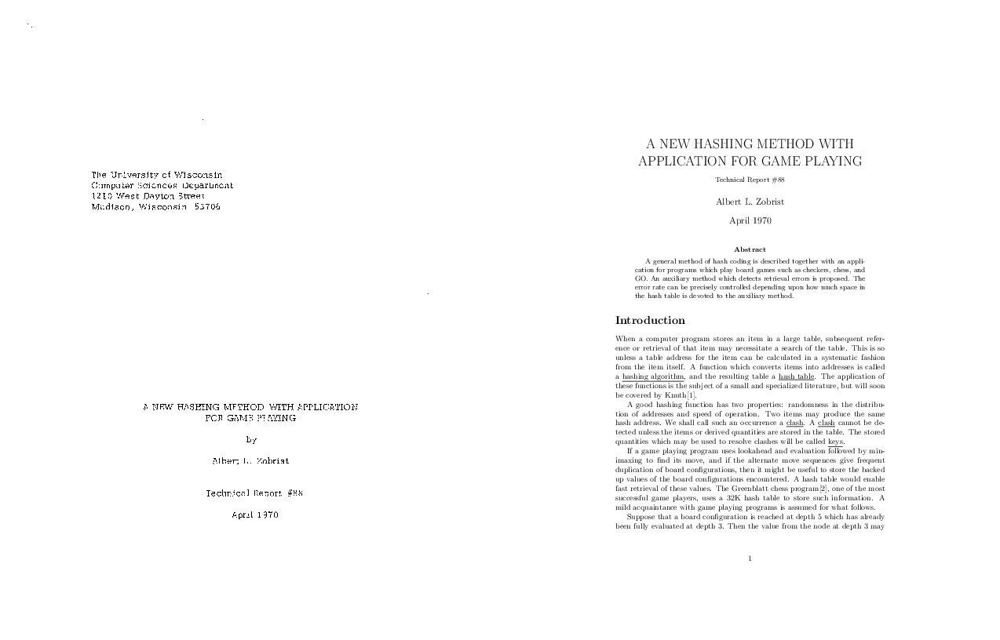

# tr88
Technical Report 88, A NEW HASHING METHOD WITH APPLICATION FOR GAME PLAYING.

LaTeX transcription of [paper](http://research.cs.wisc.edu/techreports/1970/TR88.pdf) while [reading](https://www.manning.com/books/deep-learning-and-the-game-of-go) about Zobrist hashing.

[A22036](https://cs.stackexchange.com/a/22036):

> The Zobrist hash function has an important advantage over a completely random
> hash function: it is easy to compute. Moreover, it is easy to update after a
> move of a single piece on the board. It is this last property which makes it
> especially attractive for hashing board positions.

